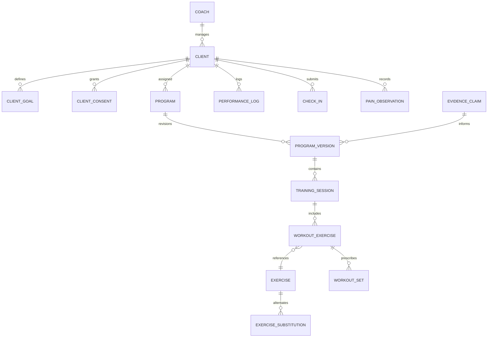

# AI Coach OS — Target Architecture Specification

**Document Purpose:** Architectural blueprint for AI Coach OS target state  
**Project:** AI Coach OS (Evidence-based coaching operating system for human gym coaches in Egypt)  
**Architecture Style:** Modular Monolith with Domain-Driven Core  
**Target Tech Stack:**
- **Backend:** ASP.NET Core 8 / C#
- **Frontend:** Angular 16+ / TypeScript
- **Database:** PostgreSQL (via Entity Framework Core & Npgsql)
- **Authentication:** ASP.NET Core Identity with JWT / Bearer Tokens (Decided post-audit)
- **CI/CD:** GitHub Actions
- **Containerization / Local Dev:** Docker Compose (PostgreSQL)

---

## 1. Core Product Philosophy & Reasoning Architecture

AI Coach OS is designed as an evidence-based decision-support operating system for human gym coaches in Egypt. It is **neither a generic chatbot nor a template-based workout generator**.

### 1.1 The Central Coaching Reasoning Chain
Traditional fitness applications use static templates:
$$\text{Goal} \rightarrow \text{Template} \rightarrow \text{Weekly Sets} \rightarrow \text{Exercise Slots}$$

AI Coach OS implements an evidence-based physiological reasoning chain:
$$\text{Person} \rightarrow \text{Goal} \rightarrow \text{Constraints} \rightarrow \text{Stimulus} \rightarrow \text{Fatigue} \rightarrow \text{Recovery} \rightarrow \text{Adaptation} \rightarrow \text{Progression} \rightarrow \text{Monitoring} \rightarrow \text{Adjustment}$$

Key design axioms:
1. **Stimulus vs. Fatigue Optimization:** Weekly volume is an observable output and tool, not an arbitrary target. Programs optimize the ratio of muscle stimulus to systemic/joint fatigue.
2. **Constraint-Driven Emergence:** Program structures (e.g., Full Body vs. Upper/Lower, 3-day vs. 4-day) emerge dynamically from individual client constraints (time, equipment, injury history, recovery capacity).
3. **Strict Separation of Determinism and AI:** Deterministic algorithms handle volume counting, progression math, schedule math, and hard safety boundaries. The AI layer handles contextual reasoning, trade-off explanations, synthesis of conflicting cues, and coach communication.

```
                   ┌───────────────────────────────────────────────┐
                   │                  AI COACH OS                  │
                   └───────────────────────┬───────────────────────┘
                                           │
         ┌─────────────────────────────────┼─────────────────────────────────┐
         │                                 │                                 │
┌────────┴────────┐               ┌────────┴────────┐               ┌────────┴────────┐
│  Client Memory  │               │    Knowledge    │               │  Deterministic  │
│    & Context    │               │   Base (EBM)    │               │   Algorithms    │
└────────┬────────┘               └────────┬────────┘               └────────┬────────┘
         │                                 │                                 │
         └─────────────────────────────────┼─────────────────────────────────┘
                                           │
                                           ▼
                            ┌──────────────────────────────┐
                            │    Coaching Domain Brain     │
                            │ (Stimulus, Fatigue, Safety)  │
                            └──────────────┬───────────────┘
                                           │
                                           ▼
                            ┌──────────────────────────────┐
                            │  AI Reasoning & Explanation  │
                            └──────────────┬───────────────┘
                                           │
                                           ▼
                            ┌──────────────────────────────┐
                            │    Coach Decision Package    │
                            │   (Human Review & Approval)  │
                            └──────────────────────────────┘
```

---

## 2. Authentication Decision: ASP.NET Core Identity vs. Supabase Auth

The M0 audit specifically investigated whether to use **ASP.NET Core Identity** or **Supabase Auth**.

### 2.1 Comparative Analysis

| Criteria | ASP.NET Core Identity | Supabase Auth (Hosted) |
| :--- | :--- | :--- |
| **Architectural Cohesion** | Native to ASP.NET Core 8 (`MapIdentityApi`, EF Core Identity DbContext). | External SaaS dependency; requires custom JWT validation middleware. |
| **Data Integrity & Relationships** | Direct foreign keys between `IdentityUser` and domain `Coach` / `Client` tables in PostgreSQL. | Separate `auth.users` schema; requires webhooks or sync jobs to maintain domain links. |
| **Local Development & Offline** | 100% self-contained in local PostgreSQL; runs offline without internet connectivity. | Requires connection to Supabase cloud or running the multi-container Supabase local CLI stack. |
| **Egyptian Network Latency** | Zero external latency; auth is processed locally or in the deployed backend container. | Subject to external international routing and latency spikes to Supabase edge servers. |
| **Data Sovereignty & Privacy** | Client records and coach credentials remain within the coach's dedicated database. | Authentication credentials stored on third-party multi-tenant cloud infrastructure. |
| **Licensing & Ongoing Costs** | Free, open-source, no user tiers or MAU billing. | Free tier capped at 50,000 MAU; paid tiers for enterprise features. |

### 2.2 Final Decision
**ASP.NET Core Identity with Entity Framework Core (PostgreSQL via Npgsql) is chosen.**

**Rationale:**
1. Direct relational consistency: A `Coach` domain entity directly references `IdentityUser.Id` with transactional referential integrity.
2. Self-containment: Eliminates external cloud dependencies, enabling rapid local development, automated integration testing via `WebApplicationFactory`, and deployment flexibility.
3. ASP.NET Core 8 provides native Identity endpoints (`MapIdentityApi<IdentityUser>()`) supporting token-based authentication out of the box.

---

## 3. Technology Stack Specification

```text
Backend:
  Runtime: .NET 8 LTS (C# 12)
  Framework: ASP.NET Core Web API
  ORM: Entity Framework Core 8 with Npgsql (PostgreSQL provider)
  Validation: FluentValidation
  Testing: xUnit, FluentAssertions, Moq/NSubstitute, WebApplicationFactory

Frontend:
  Runtime: Node.js 18 LTS
  Framework: Angular 16+ (TypeScript 5)
  Architecture: Standalone components, reactive state management (RxJS / Signals)
  Routing: Angular Router with Auth Guards
  Styling: Tailwind CSS or Angular Material (clean, accessible UI for coaches)
  Testing: Jasmine / Karma (or Vitest)

Database:
  Engine: PostgreSQL 16
  Driver: Npgsql.EntityFrameworkCore.PostgreSQL
  Migrations: EF Core Code-First Migrations
  Storage: Relational tables with JSONB columns for semi-structured metadata

DevOps & Tooling:
  Local Dev: Docker Compose for local PostgreSQL 16
  CI/CD: GitHub Actions (build, lint, test, format checks)
```

---

## 4. Modular Monolith Architecture

The system is organized as a **Modular Monolith**. Each domain module encapsulates its own domain models, business logic, data persistence configurations, and contracts, avoiding tight coupling while maintaining a single deployable unit.

```
ai-coach-os/
├── .github/
│   └── workflows/
│       └── ci.yml                         # Automated build, test, and lint workflow
├── docker/
│   └── docker-compose.dev.yml             # Local PostgreSQL container definition
├── docs/
│   ├── architecture/
│   │   ├── current-state.md
│   │   └── target-state.md
│   └── milestones/
│       └── M0-report.md
├── src/
│   ├── backend/
│   │   ├── AiCoachOs.sln
│   │   ├── AiCoachOs.Api/                 # Web API entrypoint, controllers, middleware, DI
│   │   ├── AiCoachOs.Core/                # Domain entities, value objects, business rules
│   │   │   └── Modules/
│   │   │       ├── Clients/               # Client profile, intake, goals, consent
│   │   │       ├── Training/              # Frequency, schedule, stimulus/fatigue logic
│   │   │       ├── Exercises/             # Exercise library, biomechanics, substitutions
│   │   │       ├── Programs/              # Program design engine, session builder, progression
│   │   │       ├── Nutrition/             # Energy balance, Egyptian food database, macros
│   │   │       ├── Safety/                # Red flags, medical boundaries, pain triage
│   │   │       ├── Knowledge/             # Scientific evidence claims, citations, versions
│   │   │       └── Ai/                    # Foundation model provider, prompt pipelines
│   │   ├── AiCoachOs.Infrastructure/      # EF Core DbContext, migrations, Identity, repos
│   │   └── AiCoachOs.Tests/               # Unit and integration test suites
│   │       ├── Unit/
│   │       └── Integration/
│   └── frontend/
│       ├── package.json
│       ├── angular.json
│       ├── tsconfig.json
│       └── src/
│           ├── app/
│           │   ├── core/                  # Auth services, HTTP interceptors, guards
│           │   ├── shared/                # UI components, pipes, directives
│           │   └── features/              # Feature modules
│           │       ├── auth/              # Login, register
│           │       ├── clients/           # Client list, intake form, client overview
│           │       ├── exercises/         # Exercise catalog, substitution explorer
│           │       ├── programs/          # Program designer, session view, progression
│           │       ├── nutrition/         # Macro calculator, meal plan builder
│           │       └── review/            # Coach Decision Package review UI
```

---

## 5. Domain Module Specifications

### 5.1 Clients Module (`AiCoachOs.Core.Modules.Clients`)
- **Entities:** `Coach`, `Client`, `ClientGoal`, `ClientConsent`, `ClientMeasurement`, `ClientCheckIn`.
- **Responsibilities:**
  - Coach-to-client relationship management and data tenancy isolation.
  - Flexible intake processing (graceful handling of incomplete/sparse client data).
  - Explicit consent recording and audit logging.

### 5.2 Exercises Module (`AiCoachOs.Core.Modules.Exercises`)
- **Entities:** `Exercise`, `MuscleGroup`, `MovementPattern`, `Equipment`, `ExerciseSubstitution`.
- **Responsibilities:**
  - Rich biomechanical classification (resistance profiles: lengthened, shortened, uniform).
  - Substitution hierarchy based on intent, equipment availability, and joint comfort.
  - Egyptian gym equipment compatibility (e.g., local machines, dumbbells, cables).

### 5.3 Training & Programs Module (`AiCoachOs.Core.Modules.Programs`)
- **Entities:** `Program`, `ProgramVersion`, `TrainingSession`, `WorkoutExercise`, `WorkoutSet`, `PerformanceLog`.
- **Responsibilities:**
  - Deterministic program generation based on availability (2, 3, 4, 5 days) and session duration constraints.
  - Stimulus-to-fatigue ratio (SFR) calculation.
  - Rep-in-reserve (RIR) and RPE-based autoregulation.
  - Progression algorithms and plateau detection.

### 5.4 Safety & Medical Module (`AiCoachOs.Core.Modules.Safety`)
- **Entities:** `SafetyFlag`, `PainObservation`, `MedicalEscalation`.
- **Responsibilities:**
  - Deterministic red-flag screening (acute pain, nerve symptoms, contraindications).
  - Strict medical boundary enforcement (no medical diagnoses, educational language only).
  - Conservative training modification recommendations.

### 5.5 Nutrition Module (`AiCoachOs.Core.Modules.Nutrition`)
- **Entities:** `NutritionPlan`, `EgyptianFoodItem`, `MacroTarget`, `WeightTrendLog`.
- **Responsibilities:**
  - Calorie estimation calibrated to ongoing weight trends rather than rigid equations.
  - Egyptian localized food database (baladi bread, foul, koshary, local dairy/meat).
  - Budget-aware protein optimization.

### 5.6 Knowledge & Evidence Module (`AiCoachOs.Core.Modules.Knowledge`)
- **Entities:** `KnowledgeSource`, `EvidenceClaim`, `EvidenceVersion`, `EvidenceLevel`.
- **Responsibilities:**
  - Hierarchical evidence classification (Meta-analyses > RCTs > Expert consensus).
  - Versioned claims linked directly to program design rules.
  - Traceability: every automated recommendation links to underlying evidence claims.

### 5.7 AI Reasoning Layer (`AiCoachOs.Core.Modules.Ai`)
- **Components:** `IAiProvider`, `StructuredDecisionEngine`, `PromptBuilder`.
- **Responsibilities:**
  - Accepts pre-computed, deterministic client context and returns structured decisions.
  - Produces the **Coach Decision Package** (JSON contract containing observations, recommendations, rationale, evidence citations, and confidence scores).
  - Leaves the final approval to the human gym coach.

---

## 6. High-Level Data Model (PostgreSQL)



---

## 7. Migration Path: From Greenfield Baseline to Target Architecture

Since the repository is greenfield (0 legacy lines of code), migration follows an **additive scaffolding and milestone-driven implementation path**:

| Step | Milestone | Objectives |
| :--- | :--- | :--- |
| **1** | **M0 (Current)** | Audit baseline, verify host runtimes, document current & target architecture, establish M0 report. |
| **2** | **M1 Setup** | Initialize Git (`git init`), scaffold `.gitignore`, create Docker Compose for PostgreSQL, scaffold .NET 8 solution and Angular 16+ project. |
| **3** | **M1 Core** | Implement ASP.NET Core Identity, EF Core DbContext, Coach & Client domain entities, flexible intake API, and Angular client management UI. |
| **4** | **M2** | Build Exercise & Training domain models, equipment tagging, substitution logic, and exercise catalog UI. |
| **5** | **M3** | Construct scientific Knowledge Base entity schema, evidence versioning, and initial resistance training rules. |
| **6** | **M4** | Build the deterministic Program Designer engine (ConstraintAnalyzer, RecoveryModel, SessionBuilder). |
| **7** | **M5-M6** | Add workout logging, RIR tracking, progression algorithms, and adaptive coaching triggers. |
| **8** | **M7-M13** | Layer in Safety/Pain triage, Egyptian Nutrition, Long-Term Memory, and AI Provider integration. |

---

## 8. Summary of Architectural Guardrails
1. **Never generate programs solely from LLM prompts:** Program structure is determined by domain logic; the LLM augments with explanations and contextual refinement.
2. **Never chase arbitrary volume:** Weekly sets emerge from client recovery and availability constraints.
3. **Never bypass human coach approval:** AI recommendations are packaged into the Coach Decision Package for explicit coach confirmation.
4. **Enforce clean module boundaries:** Avoid circular dependencies between modules; communicate via well-defined domain events or query interfaces.
