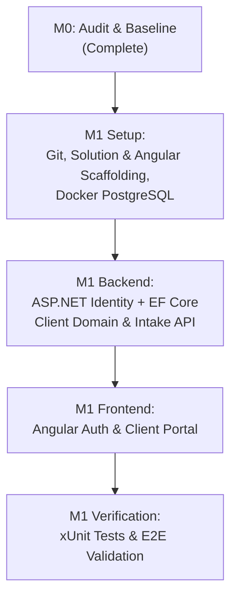

# Milestone M0 Report — Repository Audit & Baseline

**Project:** AI Coach OS  
**Milestone:** M0 (Repository Audit & Baseline)  
**Status:** COMPLETED  
**Date:** September 19, 2026  
**Auditor:** Agentic Pair Programmer  
**Deliverables Produced:**
1. `docs/architecture/current-state.md`
2. `docs/architecture/target-state.md`
3. `docs/milestones/M0-report.md`

---

## 1. Executive Summary

Milestone M0 is an **audit-only** phase intended to thoroughly assess the repository, environment, and architectural baseline of AI Coach OS before touching code or introducing modifications.

The repository at `d:\Coaching\Project\Ai Coaching` is currently a **greenfield workspace** containing no pre-existing code, project files, or databases. The master product requirements and architecture plans are documented in `d:\Coaching\AI_Coach_OS_Master_Plan updated.md` (3,854 lines) and `d:\Coaching\AI_Coach_OS_Master_Plan.md` (2,549 lines).

All host development runtimes required for the non-negotiable target stack (.NET 8 SDK, Node.js 18, npm 10, Angular CLI 16) are present on the host system. The local database services (PostgreSQL) and the Docker engine are currently stopped.

No features were implemented, no schemas were modified, and no refactoring was performed during this milestone.

---

## 2. Current State Summary

| Dimension | Findings |
| :--- | :--- |
| **Workspace Status** | Clean slate / greenfield (`0` source files, `0` folders prior to `docs/`). |
| **Backend Code** | None present. No `.sln`, `.csproj`, or C# files. |
| **Frontend Code** | None present. No `package.json`, `angular.json`, or TypeScript files. |
| **Database** | No database exists; no ORM or migrations; no active local PostgreSQL service. |
| **Authentication** | None implemented. |
| **APIs** | None implemented. |
| **Tests** | Zero tests; test coverage is `0.0%`. |
| **CI/CD** | None configured; no GitHub Actions workflows exist. |
| **Version Control** | Git is not yet initialized in `d:\Coaching\Project\Ai Coaching`. |
| **Host Environment** | .NET 8 SDK (8.0.414), Node.js (v18.20.5), npm (10.8.2), and Angular CLI (16.2.16) are installed. Docker CLI is installed, but the Docker daemon is currently not running. |
| **Can the App Run?** | **No.** The application cannot run because no executable code or project scaffold currently exists in the workspace. |

---

## 3. Target State Summary

The target state is defined by the project requirements and master plan:
- **Architecture:** Modular Monolith with clean domain separation.
- **Backend:** ASP.NET Core 8 Web API (C# 12) structured by feature/domain modules (`Clients`, `Training`, `Exercises`, `Programs`, `Nutrition`, `Safety`, `Knowledge`, `Ai`).
- **Frontend:** Angular 16+ with TypeScript, standalone components, and reactive state management.
- **Database:** PostgreSQL 16 managed via Entity Framework Core 8 with Npgsql.
- **Authentication:** **ASP.NET Core Identity** with EF Core in PostgreSQL (selected over Supabase Auth for direct data tenancy, offline reliability, lack of vendor lock-in, and transactional consistency).
- **Core Reasoning Engine:** Person $\rightarrow$ Goal $\rightarrow$ Constraints $\rightarrow$ Stimulus $\rightarrow$ Fatigue $\rightarrow$ Recovery $\rightarrow$ Adaptation $\rightarrow$ Progression $\rightarrow$ Monitoring $\rightarrow$ Adjustment.
- **Decision Workflow:** Separation of deterministic calculations from AI reasoning; outputs delivered via the structured **Coach Decision Package** for human coach approval.

---

## 4. Gap Analysis

| Layer / Component | Current State | Target State | Gap / Action Required |
| :--- | :--- | :--- | :--- |
| **Repository & Git** | Uninitialized directory | Git repository with `.gitignore`, README, and branch protection | Run `git init`, add standard `.gitignore` for .NET/Node. |
| **Backend Scaffold** | None | .NET 8 Solution with `Api`, `Core`, `Infrastructure`, and `Tests` | Create ASP.NET Core Web API and class library projects. |
| **Frontend Scaffold** | None | Angular 16+ project with standalone components and routing | Generate Angular app using `@angular/cli`. |
| **Database Engine** | None running | PostgreSQL 16 instance | Configure `docker-compose.dev.yml` for PostgreSQL 16. |
| **Data Access** | None | EF Core 8 DbContext with Npgsql & Code-First migrations | Implement DbContext, entity configurations, and initial migration. |
| **Authentication** | None | ASP.NET Core Identity with Bearer tokens / JWT | Configure Identity Core, user stores, and auth endpoints. |
| **Domain Logic** | Master Plan docs | C# Domain models for Coach, Client, Intake, Consent | Implement `Clients` module domain models and validation rules. |
| **API Endpoints** | None | RESTful API endpoints for Auth and Client management | Implement controllers/endpoints for coach auth and client intake CRUD. |
| **Frontend UI** | None | Coach portal with Auth and Client management views | Build Angular views: Login, Client List, Intake Wizard, Profile. |
| **Test Suite** | None | xUnit test suite (unit + integration) and Angular tests | Setup `AiCoachOs.Tests` with xUnit, FluentAssertions, and WebApplicationFactory. |
| **CI/CD** | None | GitHub Actions running build, test, and lint on PRs | Create `.github/workflows/ci.yml`. |

---

## 5. Technical Debt & Environmental Risks Found

Because this is a greenfield repository, there is **zero legacy code debt** (no legacy bugs, dead code, or spaghetti architecture). However, there is notable **initialization debt and environmental friction**:

1. **Docker Daemon Inactive:**
   - *Observation:* `docker info` fails because the Docker Desktop daemon is stopped on the host.
   - *Impact:* Running PostgreSQL via Docker Compose for local development requires starting Docker Desktop or running PostgreSQL natively.
   - *Mitigation:* Ensure Docker Desktop is started prior to local database testing, or provide instructions/scripts for local PostgreSQL startup.
2. **Git Repository Uninitialized:**
   - *Observation:* No `.git` folder exists in the project folder.
   - *Impact:* Changes cannot be version-controlled or tracked across milestones until initialized.
   - *Mitigation:* Initialize Git and commit M0 documentation before starting M1.
3. **Absence of CI/CD Pipeline:**
   - *Observation:* No automated validation exists to guard against regressions.
   - *Impact:* Breaking changes could go unnoticed as modules are added.
   - *Mitigation:* Scaffold `.github/workflows/ci.yml` early in M1 to enforce continuous integration.
4. **Domain Complexity & Scope Creep Risk:**
   - *Observation:* The Master Plan specifies an extensive 20-milestone roadmap including biomechanics, Egyptian food databases, vision analysis, and evidence versioning.
   - *Impact:* Attempting to model too many domains simultaneously will cause over-engineering.
   - *Mitigation:* Strictly adhere to the incremental milestone plan. M1 must focus exclusively on the core coach + client workflow.

---

## 6. Recommended Migration & Scaffolding Approach

Since this is a greenfield implementation, the migration path is **pure additive scaffolding**:

1. **Infrastructure First:**
   - Initialize Git repository and add comprehensive `.gitignore` (.NET, Node, Angular, OS artifacts).
   - Create `docker-compose.dev.yml` for PostgreSQL 16.
2. **Backend Scaffolding:**
   - Create solution `AiCoachOs.sln`.
   - Scaffold projects:
     - `AiCoachOs.Core` (domain entities, interfaces, validation).
     - `AiCoachOs.Infrastructure` (EF Core DbContext, Npgsql, ASP.NET Identity).
     - `AiCoachOs.Api` (ASP.NET Core Web API, controllers, Swagger, middleware).
     - `AiCoachOs.Tests` (xUnit test project).
3. **Frontend Scaffolding:**
   - Scaffold Angular application in `src/frontend` using Angular CLI.
   - Configure proxy to the ASP.NET Core API backend.
4. **Milestone-by-Milestone Verification:**
   - Do not advance to M2 until M1 acceptance criteria pass completely.

---

## 7. Migration Complexity Estimate

- **Legacy Migration Complexity:** **None (Greenfield)**. There are no legacy databases to migrate, no legacy frameworks to deprecate, and no brittle existing code to untangle.
- **Architectural Implementation Complexity:** **Moderate**. The domain requires careful modeling of sparse/flexible client intake, coach-client authorization tenancy, and solid foundational abstractions to prepare for future physiological reasoning engines.

---

## 8. What Milestone M1 Should Address First

Milestone M1 is titled **Core Coach + Client Workflow**. Its primary objective is to build a rock-solid foundation for the application.

### Detailed M1 Execution Blueprint:
1. **Repository Setup:**
   - Execute `git init` and commit baseline documentation.
   - Create `docker/docker-compose.dev.yml` targeting PostgreSQL 16.
2. **Backend Foundation:**
   - Scaffold .NET 8 solution (`AiCoachOs.sln`).
   - Configure EF Core with Npgsql and ASP.NET Core Identity.
   - Implement `Coach` and `Client` entities with support for flexible intake (optional demographics, goals, constraints).
   - Implement client consent tracking entity (`ClientConsent`).
   - Expose RESTful endpoints:
     - `POST /api/auth/register` & `POST /api/auth/login`
     - `GET /api/clients` (paged list for authenticated coach)
     - `POST /api/clients` (create client with flexible/sparse data)
     - `GET /api/clients/{id}` (client profile details)
     - `PUT /api/clients/{id}` (update client profile)
     - `DELETE /api/clients/{id}` (soft-delete / archive client)
3. **Frontend Foundation:**
   - Scaffold Angular 16+ application with Angular Router.
   - Implement authentication service, login form, and route guards.
   - Implement Client List view and Client Intake Form.
   - Ensure the UI gracefully handles missing optional intake fields.
4. **Testing & CI:**
   - Unit tests for client intake validation rules.
   - Integration tests verifying coach tenancy (coaches can only see their own clients).
   - Scaffold GitHub Actions workflow for build and test automation.

---

## 9. Acceptance Criteria Verification Checklist

- [x] **The application can run (or the reason it cannot is documented):** Fully documented. The application cannot run because the workspace is in a greenfield, pre-initialization state with 0 executable files.
- [x] **Current tech stack is fully identified:** Host runtimes identified (.NET 8.0.414, Node 18.20.5, npm 10.8.2, Angular CLI 16.2.16, Docker Desktop CLI 24.0.6). Workspace currently has 0 packages/projects.
- [x] **Current database schema is fully documented:** Documented that no database, ORM, or schema currently exists.
- [x] **Current auth method is identified:** Documented that no auth currently exists; evaluated ASP.NET Identity vs. Supabase Auth and officially selected ASP.NET Core Identity.
- [x] **All three documentation files exist and are complete:**
  - `docs/architecture/current-state.md`
  - `docs/architecture/target-state.md`
  - `docs/milestones/M0-report.md`
- [x] **No features were added or changed:** Zero code or features modified. Strict audit-only scope maintained.
- [x] **Build/lint/test status is known:** Documented system tool outputs and noted project-level build failure due to uninitialized projects.
